<p align="center">
  
</p>


<!-- ============================================================
     SYSTEMS ONLINE. DEPTH: CLASSIFIED.
     ============================================================ -->

<div align="center">

```
██████╗ ██╗   ██╗██╗██╗     ██████╗
██╔══██╗██║   ██║██║██║     ██╔══██╗
██████╔╝██║   ██║██║██║     ██║  ██║
██╔══██╗██║   ██║██║██║     ██║  ██║
██████╔╝╚██████╔╝██║███████╗██████╔╝
╚═════╝  ╚═════╝ ╚═╝╚══════╝╚═════╝
```

**`[ ENTERPRISE AI · ALGORITHM ARCHITECTURE · FULL-STACK SYSTEMS ]`**

*The foundation holds. The intelligence compounds. The work speaks.*

</div>

---

```
┄┄┄┄┄┄┄┄┄┄┄┄┄┄┄┄┄┄┄┄┄┄  CORE DIRECTIVE  ┄┄┄┄┄┄┄┄┄┄┄┄┄┄┄┄┄┄┄┄┄┄

  I don't wrap APIs and call it AI.
  I don't chase frameworks that won't exist next year.
  I build systems engineered to outlast the hype.

  Every line has a reason. Every architecture has a philosophy.
  What ships is production — not a proof of concept with ambition.

┄┄┄┄┄┄┄┄┄┄┄┄┄┄┄┄┄┄┄┄┄┄┄┄┄┄┄┄┄┄┄┄┄┄┄┄┄┄┄┄┄┄┄┄┄┄┄┄┄┄┄┄┄┄┄┄┄┄┄┄┄┄
```

---

## `01` &nbsp; The Language

<table>
<tr>
<td width="60">🐍</td>
<td><strong>Python. Primary. Always.</strong><br/>Not a preference — a precision instrument. Every AI pipeline, orchestration layer, algorithmic engine, and production backend is written in Python. The stack may vary at the edges. The core never does.</td>
</tr>
</table>

---

## `02` &nbsp; The Decision Engine

When a problem arrives, the first question isn't *how* — it's *what kind*.

```
╔══════════════════════════════════════════════════════════╗
║                    INCOMING PROBLEM                      ║
╚══════════════════════╤═══════════════════════════════════╝
                       │
          ┌────────────▼────────────┐
          │   CERTAINTY ANALYSIS    │
          │   Is the domain fixed?  │
          │   Is the signal clean?  │
          └──────┬──────────┬───────┘
                 │          │
         YES ◄───┘          └───► NO
                 │          │
    ┌────────────▼──┐   ┌───▼────────────────┐
    │ DETERMINISTIC │   │   LEARNING SYSTEM  │
    │ LOGIC ENGINE  │   │   Paradigm-matched │
    │ Precise rules │   │   to the data type │
    └────────┬──────┘   └───────────┬────────┘
             │                      │
             └──────────┬───────────┘
                        │
           ┌────────────▼────────────┐
           │    SYSTEM ARCHITECTURE  │
           │   Python · Linux · Zero │
           │      Architectural Debt │
           └────────────┬────────────┘
                        │
                        ▼
              ◈  PRODUCTION — NO GAPS  ◈
```

> *The classification logic behind that fork is proprietary. It stays that way.*

---

## `03` &nbsp; Stack Topology

```
 ╭──────────────────────────────────────────────────────────────╮
 │  LAYER          TECHNOLOGY          SIGNAL                   │
 ├──────────────────────────────────────────────────────────────┤
 │  BACKEND                                                     │
 │  ·············  Python              ▓▓▓▓▓▓▓▓▓▓▓▓  Primary   │
 │  ·············  AI / ML Systems     ▓▓▓▓▓▓▓▓▓▓░░  Precise   │
 │  ·············  Algorithm Design    ▓▓▓▓▓▓▓▓▓░░░  Custom    │
 ├──────────────────────────────────────────────────────────────┤
 │  INFRASTRUCTURE                                              │
 │  ·············  Linux               ▓▓▓▓▓▓▓▓▓▓▓▓  Native    │
 │  ·············  Docker / CI/CD      ▓▓▓▓▓▓▓▓▓░░░  Hardened  │
 ├──────────────────────────────────────────────────────────────┤
 │  FRONTEND                                                    │
 │  ·············  HTML · CSS · JS     ▓▓▓▓▓▓▓▓▓▓░░  Always    │
 │  ·············  React / TypeScript  ▓▓▓▓▓▓░░░░░░  Earned    │
 ├──────────────────────────────────────────────────────────────┤
 │  ▓▓▓▓  SHADOW STACK                 ░░░░░░░░░░░░  Private   │
 ╰──────────────────────────────────────────────────────────────╯
```

---

## `04` &nbsp; Engineering Philosophy

&nbsp;&nbsp;&nbsp;**`[01]` UNIX-NATIVE BY DESIGN**
&nbsp;&nbsp;&nbsp;&nbsp;&nbsp;&nbsp;&nbsp;&nbsp;Not deployed on Linux. *Architected* in Linux. Modular at every layer, minimal footprint, no debt baked in at the foundation.

&nbsp;&nbsp;&nbsp;**`[02]` PRODUCTION MEANS PRODUCTION**
&nbsp;&nbsp;&nbsp;&nbsp;&nbsp;&nbsp;&nbsp;&nbsp;What ships is auditable, load-tested, and repeatable. Stability is engineered in — not patched after the fact.

&nbsp;&nbsp;&nbsp;**`[03]` KNOWLEDGE IS INFRASTRUCTURE**
&nbsp;&nbsp;&nbsp;&nbsp;&nbsp;&nbsp;&nbsp;&nbsp;Every system built compounds into a private body of work. The gaps close. The edge sharpens. No destination — only depth.

---

## `05` &nbsp; What I Build

```
  ┌─────────────────────────────────────────────────────────┐
  │                                                         │
  │   End-to-end enterprise AI systems.                     │
  │                                                         │
  │   Algorithm design → production infrastructure.         │
  │   Real stakes. Real data. Real delivery.                │
  │                                                         │
  │   The R&D behind it remains private.                    │
  │                                                         │
  └─────────────────────────────────────────────────────────┘
```

---

## `06` &nbsp; Occasionally

When a concept earns public attention, I write about it or teach it.
**Building, researching, and shipping always comes first.**

---

<div align="center">

```
╔═══════════════════════════════════════════════════╗
║        ◈  STATUS: RESEARCH MODE — ACTIVE  ◈       ║
╠═══════════════════════════════════════════════════╣
║  Cognitive resources allocated to proprietary     ║
║  architectural research and systems development.  ║
╚═══════════════════════════════════════════════════╝
```

<br/>

[](https://python.org)&nbsp;
[](https://kernel.org)&nbsp;
[](#)&nbsp;
[](#)

<br/>

*The surface is intentional. What's underneath is the point.*

</div>

<!-- ── depth is the only metric that matters ── -->
