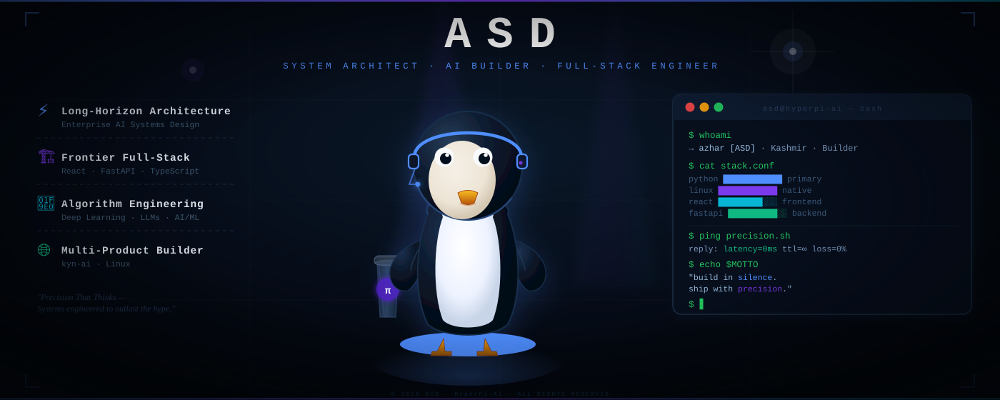
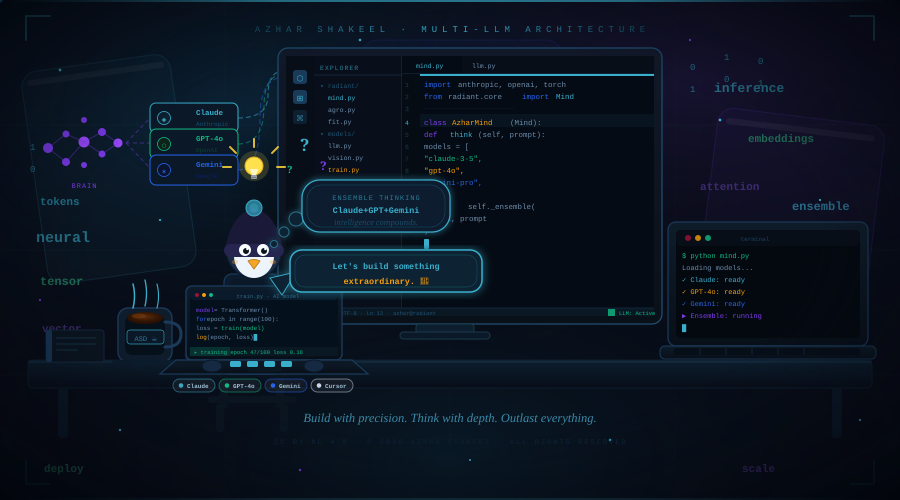
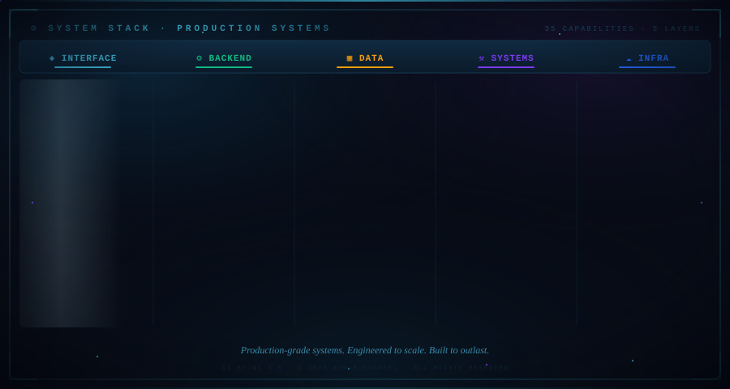

<p align="center">
  
</p>

<!-- ============================================================
     SYSTEMS ONLINE. DEPTH: CLASSIFIED.
     ============================================================ -->

<div align="center">



**`[ SYSTEM ARCHITECT · ALGORITHM DESIGN · FULL-STACK SYSTEMS ]`**

*The foundation holds. The intelligence compounds. The work speaks for itself.*

<br/>


&nbsp;
[](https://github.com/azharshakeel)
&nbsp;
[](LICENSE)

</div>

---

```
┄┄┄  CORE DIRECTIVE  ┄┄┄
  I don't wrap APIs and call it AI.
  I don't chase frameworks that
  won't exist next year.

  I build systems engineered
  to outlast the hype.

  Every line has a reason.
  Every architecture, a philosophy.
  What ships is production —
  never a proof of concept
  wearing ambition.
┄┄┄┄┄┄┄┄┄┄┄┄┄┄┄┄┄┄┄┄┄┄┄
```

---

## `01` &nbsp; The Language

<table>
<tr>
<td width="60">🐍</td>
<td><strong>Python. Primary. Always.</strong><br/>Not a preference — a precision instrument. Every pipeline, orchestration layer, algorithmic engine, and production backend runs on it. The edges may shift. The core never moves.</td>
</tr>
</table>

---

## `02` &nbsp; The Decision Engine

Every problem starts with one question — not *how*, but *what kind*.

```
╔══════════════════════╗
║   INCOMING PROBLEM   ║
╚══════════╤═══════════╝
           │
    ┌──────▼──────┐
    │  CERTAINTY  │
    │  ANALYSIS   │
    └──┬───────┬──┘
       │       │
     YES        NO
       │       │
  ┌────▼───┐ ┌─▼────────┐
  │DETERMI-│ │ LEARNING │
  │NISTIC  │ │  SYSTEM  │
  │ LOGIC  │ │ Paradigm │
  └────┬───┘ └─┬────────┘
       └───┬───┘
    ┌──────▼──────┐
    │   SYSTEM    │
    │ARCHITECTURE │
    │Python·Linux │
    │  Zero Debt  │
    └──────┬──────┘
           │
    ◈ PRODUCTION ◈
      NO GAPS
```

> *The classification logic behind that fork is proprietary. It stays that way.*

---

## `03` &nbsp; Stack Topology

<p align="center">
  
</p>

---

## `04` &nbsp; Engineering Philosophy

&nbsp;&nbsp;&nbsp;**`[01]` UNIX-NATIVE BY DESIGN**
&nbsp;&nbsp;&nbsp;&nbsp;&nbsp;&nbsp;&nbsp;&nbsp;Not deployed on Linux — *architected* in it. Modular at every layer, minimal footprint, zero debt at the foundation.

&nbsp;&nbsp;&nbsp;**`[02]` PRODUCTION MEANS PRODUCTION**
&nbsp;&nbsp;&nbsp;&nbsp;&nbsp;&nbsp;&nbsp;&nbsp;Auditable, load-tested, repeatable. Stability is engineered in — not patched after the fact.

&nbsp;&nbsp;&nbsp;**`[03]` KNOWLEDGE IS INFRASTRUCTURE**
&nbsp;&nbsp;&nbsp;&nbsp;&nbsp;&nbsp;&nbsp;&nbsp;Every system compounds into a private body of work. The gaps close, the edge sharpens. No destination — only depth.

---

## `05` &nbsp; What I Build

```
┌──────────────────────────┐
│                          │
│  End-to-end enterprise   │
│  AI systems.             │
│                          │
│  Algorithm design →      │
│  production infra.       │
│                          │
│  Real stakes.            │
│  Real data.              │
│  Real delivery.          │
│                          │
│  The R&D behind it       │
│  stays private.          │
│                          │
└──────────────────────────┘
```

---

## `06` &nbsp; Occasionally

When a concept earns public attention, I write about it or teach it. **Building, researching, and shipping always come first.**

---

<div align="center">

```
╔═══════════════════════════╗
║   ◈  STATUS: ACTIVE  ◈    ║
╠═══════════════════════════╣
║  Research Mode — Active   ║
║  Proprietary systems &    ║
║  architectural research.  ║
╚═══════════════════════════╝
```

<br/>

[](https://python.org)
&nbsp;
[](https://kernel.org)
&nbsp;
[](#)
&nbsp;
[](#)

<br/>

*Proprietary content — All Rights Reserved. Code, brand, and design assets are protected under strict manual terms:*
*[LICENSE](LICENSE) · [NOTICE](NOTICE.md) · [ASSET_LICENSE](ASSET_LICENSE.md) · [PRIVACY](PRIVACY.md)*

<br/>

*The surface is intentional. What's underneath is the point.*

</div>

<!-- ── depth is the only metric that matters ── -->
